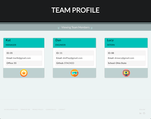

# Team-Profile Generator

Command-line application that takes in information about employees on a software engineering team, then generates in HTML webpage that displays summaries for each person.

## Table of Contents

- [Description](#description)
- [Installation](#installation)
- [Usage](#usage)
- [Tests](#tests)
- [Contributing](#contributing)
- [Visuals](#visuals)
- [Contact Me](#questions)
- [License](#license)

## Description

Node.js command-line application that takes in information about employees on a software engineering team, then generates an HTML webpage that displays summaries for each person. Includes unit tests for each class.

## Installation

Clone the repository and open it in your preferred code editor.
Navigate to the root folder in your command-line and run 'npm i' to install dependencies.

## Usage

After installation, run 'npm start' in the command-line to access the prompts and start the generator. Based on the assumption that the Manager will be funning the application, when you're prompted to enter your name, the name that is entered will populate as the Manager. Select 'complete' when all team members have been added, then open your new teamprofile.html (located in the dist folder) in the browser.

## Tests

Run 'npm test' to test.

## Contributing

Sole Author: k.wilkinson

This project was completed as an individual assignment for The Ohio State University Coding Boot Camp.

## Visuals

[GithubRepo](https://github.com/NAHco-code/Team-Profile-Generator.git)

## Questions?

Please feel free to contact me with any questions via email or LinkedIn.

- Github: [NAHco-code](https://github.com/NAHco-code)
- LinkedIn: [kwilkinsonxx](https://www.linkedin.com/in/kwilkinsonxx/)
- Email: [kathrynxwilk@gmail.com](kathrynxwilk@gmail.com)

## License

This project is licensed under the MIT License.
For more information, please visit: [MIT Explained](https://choosealicense.com/licenses/mit/)

&copy; 2021 k.wilkinson
